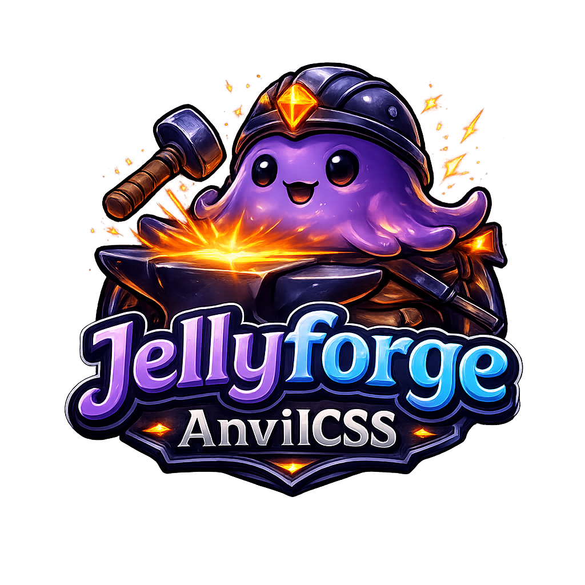

# Jellyforge AnvilCSS

<p align="center"></p>

A live, in-browser CSS theme builder for **Jellyfin**. AnvilCSS is a fully static, self-contained
web app: no server, no backend, no login, no vendored `jellyfin-web` build. A static HTML/CSS mockup
of the real Jellyfin frontend sits in the middle of the page — built from the same classnames and
IDs a real Jellyfin theme targets (`#loginPage`, `.card`, `.cardScalable`, `.mainDrawer`, ...) — and
reacts live to every change made in the sidebar, exactly like the real app would.

## Quick start (Docker)

```bash
docker compose up -d
```

Open `http://localhost:8283`. That's it — nothing to configure, no account to create.

## Development (without Docker)

```bash
npm install
npm run dev       # Vite dev server with hot reload
```

Production build (plain static HTML/JS/CSS in `dist/`):

```bash
npm run build
npm run preview   # optional local sanity check of the built output
```

`dist/` can be deployed to any static host — nginx, Portainer, GitHub Pages, a CDN — with no build
secrets, tokens, or server process required.

## The three preview views

The switcher above the mockup toggles between:

1. **Login page** — `#loginPage`, `.manualLoginForm` / `.visualLoginForm`, so the login-logo toggle
   can be tested live.
2. **Dashboard** — header, open nav drawer, poster rows with progress bars, matching real
   jellyfin-web classes (`.card`, `.cardScalable`, `.itemProgressBar`, `.countIndicator`, ...).
3. **Title detail** — backdrop, poster, the big Play button, and tabs (Overview / Cast / Details).

Clicking any poster on the dashboard opens its detail view.

## Using your theme outside AnvilCSS

The Export panel's **Copy CSS code** button (or downloaded `jellyfin-theme.css`) works against any
real Jellyfin instance: paste it into **Jellyfin Dashboard → General → Custom CSS**.

## Limitations

The dashboard/detail mockup is a representative, hand-built stand-in for jellyfin-web's real DOM —
covering the classes a theme actually touches — not a byte-for-byte clone of the full frontend. It
needs no login, API, or vendored Jellyfin source; it's a CSS preview surface, not a working media
server.

## Architecture

- **Mockup** (`src/renderer/src/mockup/`): static Login/Dashboard/Detail views built from real
  jellyfin-web classnames, and a 14-title catalog with real poster art from the TMDB image CDN.
- **Sidebar** (`src/renderer/src/App.tsx` + `src/renderer/src/panels/`): a React + Zustand app.
  Panels, top to bottom: Colors, Background, Logos, Typography, Components, Catalog, Theme Pool, CSS
  Editor (CodeMirror 6), Export, Wiki.
- **CSS generation** (`src/renderer/src/css/generator.ts`): writes literal colors and 20
  header / 20 card / 20 scrollbar / 19 button / 19 input style presets onto Jellyfin's real skin
  selectors (Jellyfin themes have no CSS variables). Manual editor edits and the generated block
  coexist via a marker model (`src/renderer/src/css/merge.ts`).
- **Theme pool** (`src/renderer/src/api.ts`): saved themes persist in the browser's `localStorage` —
  no server round-trip, no sync across devices.
- **i18n**: custom, flat JSON locales (`src/renderer/src/i18n/locales/`) — English, German, Spanish.

## Adding a translation

1. Copy `src/renderer/src/i18n/locales/en.json` → `<lang>.json`, translate values only (keep keys and `{{placeholders}}`).
2. Add the language to `LANGUAGES` and the dictionary map in `src/renderer/src/i18n/index.tsx`.
3. Add a wiki file under `src/renderer/src/wiki/content/` and register it in `src/renderer/src/wiki/content.ts`.
